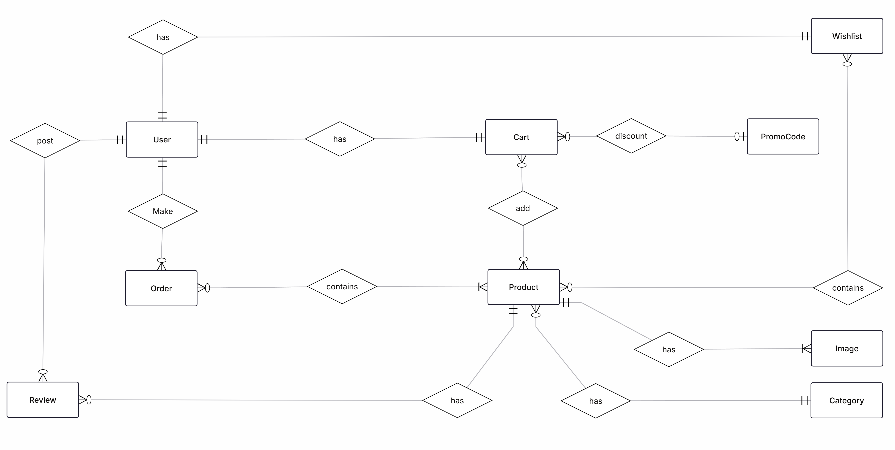

# E-Commerce

## AURA Store TODO
- Low Stoke notification for admin
- notify customer when the product is available (if he asked)
- Categories page + Manage Categories
- Contact page
- Admin can add a new role
- in/ out of stock filtering 
- ~~Forget password~~ ✅
- ~~Promocodes~~ ✅
- ~~Wishlist~~ ✅
---
## Extra
- Order Cancellation / Return Request → basic request form for refunds or returns.
- Recently Viewed Products → show a small section of last-browsed items.
- Related Products → simple “You may also like” based on category.
- Basic Sales Report(pdf or excel) → total sales per day/week/month.
- Price Range Slider → filter products within a budget.
- Product Tags
- Compare Products → add 2 products side by side (just specs & price).
- Cart items counter animation (on cart icon on the header) on the AddToCart event
---
##  ERD

